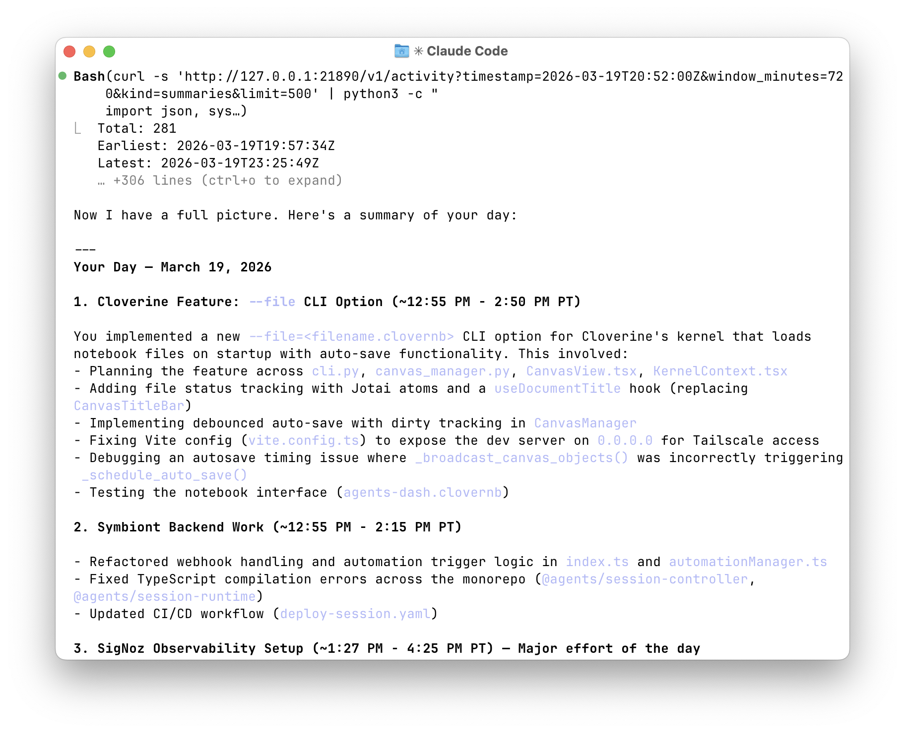

# ContextD




An efficient macOS app that continuously captures your screen activity, summarizes it
with an LLM, and makes it available for other local tools.

**How it works:** Every 2 seconds, ContextD takes a screenshot, diffs it against the
previous one, runs OCR on the changed regions, and stores the extracted text in a
local SQLite database. A background process progressively summarizes your activity
using a cheap LLM (~$2/day with Claude Haiku), and makes it available via a local HTTP API.

All data stays on your machine. The only external calls are to the OpenRouter API.

> Want to make your own changes? Point your coding agent to ./docs/SPEC.md and ask it to build your own version!

## Requirements

> **Security Warning**: This assumes that you are aware that contents of your screen would be sent to OpenRouter for summarization. If you don't know what this means or are uncomfortable, ask your coding agent one of the following: "can you check if apple's on-device language model is available, and if so, can you update the code to use that instead?" / "can you swap openrouter with a local llm api? \<insert description of your endpoint\>"

- macOS 14 (Sonoma) or later
- Swift 5.9+
- An [OpenRouter](https://openrouter.ai/) API key (for summarization and enrichment)

## Quick Start

```bash
# Clone and build
git clone https://github.com/thesophiaxu/contextd && cd contextd
make build

# Create an .app bundle (needed for macOS permission prompts)
make bundle

# Launch
open .build/ContextD.app
```

On first launch, ContextD will ask for two macOS permissions:

1. **Screen Recording** — to capture screenshots
2. **Accessibility** — to read focused window titles

Grant both, then enter your OpenRouter API key in Settings (Cmd+,).

## Usage

### HTTP API

ContextD runs a local API server on `http://127.0.0.1:21890` with interactive docs
at [http://127.0.0.1:21890/docs](http://127.0.0.1:21890/docs).

```bash
# Health check
curl http://127.0.0.1:21890/health

# Full-text search over activity summaries
curl -X POST http://127.0.0.1:21890/v1/search \
  -H 'Content-Type: application/json' \
  -d '{"text": "auth token OAuth"}'

# List recent summaries
curl 'http://127.0.0.1:21890/v1/summaries?minutes=60'

# Browse captures near a timestamp
curl 'http://127.0.0.1:21890/v1/activity?window_minutes=10&kind=captures'
```

See the [OpenAPI spec](http://127.0.0.1:21890/openapi.json) for full endpoint
documentation.

### Menu Bar

Click the eye icon in the menu bar to see capture status, pause/resume, open the
enrichment panel, or access settings.

### Enriching a Prompt

1. Press **Cmd+Shift+Space** (or click "Enrich Prompt..." in the menu bar).
2. Type or paste your prompt.
3. Select a time range (how far back to search).
4. Click **Enrich** (Cmd+Return).
5. Copy the enriched prompt (Cmd+Shift+C) and paste it into your AI assistant.

The enriched prompt will have context footnotes appended, like:

```
Your original prompt here...

---
## Context References

[^1]: (2 min ago, VS Code) The parseConfig function in src/config/parser.ts was modified...
[^2]: (5 min ago, Terminal) npm test showed 3 failing tests in auth.test.ts...
```

## Configuration

Open Settings (Cmd+, or menu bar > Settings) to configure:

| Tab       | What you can change                                                    |
|-----------|------------------------------------------------------------------------|
| General   | API key, capture interval, keyframe threshold, API server port         |
| Models    | LLM models for summarization and enrichment (Pass 1 / Pass 2)         |
| Limits    | Token limits, context window sizes, capture formatting limits          |
| Prompts   | Custom system prompts for summarization and enrichment                 |
| Storage   | Data retention period, summarization timing                            |

Default models:

| Purpose                  | Model                        |
|--------------------------|------------------------------|
| Summarization            | `anthropic/claude-haiku-4-5` |
| Enrichment Pass 1        | `anthropic/claude-haiku-4-5` |
| Enrichment Pass 2        | `anthropic/claude-sonnet-4-6`|

## How the Capture Pipeline Works

```
Screenshot ──> Pixel Diff (SIMD) ──> Frame Decision ──> Selective OCR ──> Store
                   │
                   ├── 0% changed ──────────> Skip
                   ├── <50% changed ────────> Delta (OCR changed regions only)
                   └── ≥50% / app switch ──> Keyframe (full-screen OCR)
```

- **Keyframes** store full-screen OCR text.
- **Deltas** store only the text from changed screen regions, linked to their parent keyframe.
- **Hash deduplication** prevents storing identical captures.
- **No images are stored** — screenshots are processed in memory and discarded.

## Development

```bash
make help           # Show all available targets
make run            # Build and run (debug)
make test           # Run unit tests
make watch          # Rebuild on file changes (requires: brew install fswatch)
make lint           # Check for warnings and TODOs
make loc            # Count lines of code by module
```

### Database Inspection

```bash
make db-stats       # Row counts, sizes, top apps
make db-recent      # 10 most recent captures
make db-search Q="search term"  # Full-text search
make db-shell       # Open SQLite shell

# Or use the interactive inspector
./scripts/db-inspect.sh
```

### Logs

```bash
make logs           # Stream live logs
make logs-recent    # Last 5 minutes of logs
make logs-errors    # Error-level logs from last hour
```

### Reset

```bash
./scripts/reset-all.sh          # Reset permissions + UserDefaults
./scripts/reset-all.sh --db     # Also delete the database
./scripts/reset-all.sh --full   # Also clean build artifacts
```

## Project Structure

```
ContextD/
├── App/            # Entry point, AppDelegate, service container (DI)
├── Capture/        # Screenshot, pixel diff (SIMD), OCR, accessibility
├── Storage/        # GRDB database, migrations, FTS5, record types
├── Summarization/  # Background LLM summarization, chunking
├── Enrichment/     # Two-pass prompt enrichment pipeline
├── LLMClient/      # OpenRouter API client
├── Server/         # Hummingbird HTTP API, OpenAPI spec
├── UI/             # Menu bar, settings, enrichment panel, debug view
├── Permissions/    # macOS permission management, onboarding
└── Utilities/      # Logger, prompt templates, text diff, formatters
```

For the full technical specification, see [docs/SPEC.md](docs/SPEC.md).

## Data Storage

All data is stored locally in `~/Library/Application Support/ContextD/`:

| File              | Contents                              |
|-------------------|---------------------------------------|
| `contextd.sqlite` | Captures, summaries, token usage (SQLite + FTS5) |
| `api_key`          | OpenRouter API key (plain text)       |

Default retention is 7 days (configurable in Settings > Storage).

## License

MIT
